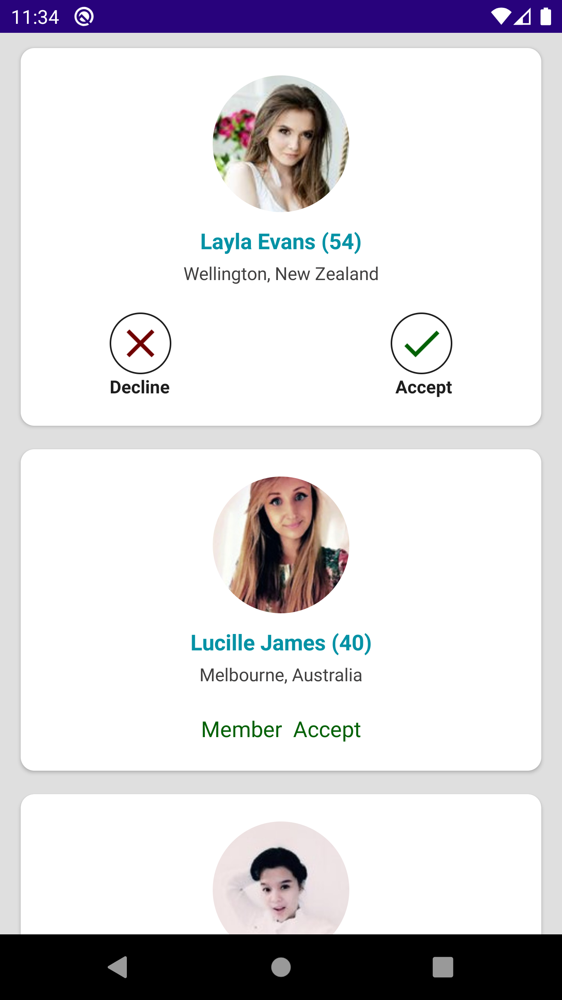

# Shaadi Test
[](https://www.android.com)


MVVM-Shaadi Test is MVVM sample project which shows Shaadi matches card with two action.

**This application was done using MVVM + Room + Koin + Coroutines  + LiveData + Retrofit.**

- MVVM Design Architecture used.
- Room for database.
- Koin for dendency injection framework.
- Retrofit.


## Screenshots

**Please click the image below to enlarge.**


<p>


</p>

   ```


